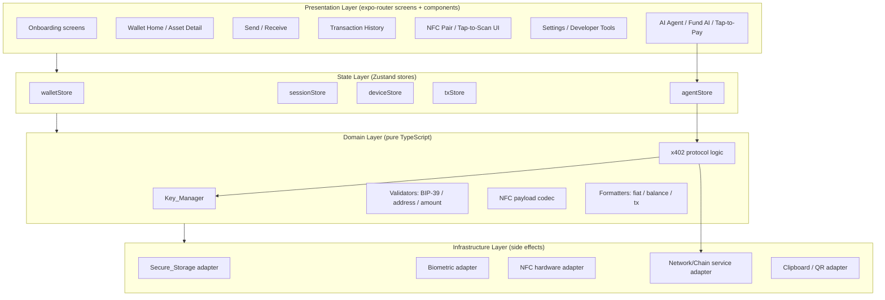
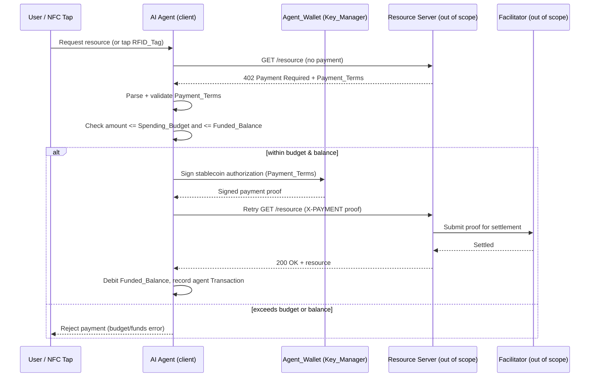
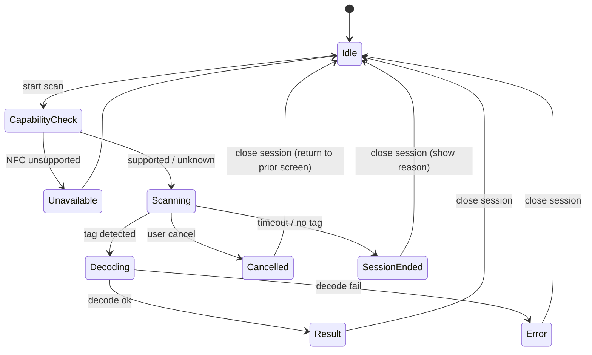
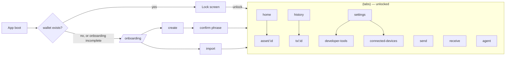

# Design Document

## Overview

Noir Wallet is a cross-platform (iOS/Android) mobile wallet built with **Expo React Native** and **TypeScript**. This design covers the mobile client: onboarding and key handling, the wallet home, NFC/RFID pairing and tap-to-scan, send/receive, transaction history, settings/developer tools, and the **x402 agentic payments** subsystem (a delegated AI Agent wallet that pays for HTTP-402 protected resources, including NFC tap-to-pay).

Scope is the client only. Backend services, blockchain nodes, indexers, price oracles, and the x402 Facilitator/settlement layer are **out of scope** except where the client must **format, validate, sign, or decode** data before submission. Concretely, in-scope client responsibilities are:

- Local key generation, BIP-39 derivation, encryption, and Secure_Storage persistence.
- Client-side validation (recovery phrase, recipient address, amount, x402 payment terms).
- Transaction and x402 authorization **signing** with the stored private key.
- NFC/RFID session management and payload encode/decode.
- UI state, navigation, session lock, and local transaction history.

Network calls (balance fetch, transaction broadcast, x402 resource requests) are modeled behind client-side **service interfaces** so the UI and logic layers can be developed and tested with mocks. The actual transport implementation against live infrastructure is intentionally abstracted.

### Key Technical Decisions

| Concern | Decision | Rationale |
|---|---|---|
| Framework | Expo React Native (managed workflow + config plugins) | Single codebase for iOS/Android, fast iteration, mature module ecosystem. |
| Navigation | `expo-router` (file-based) | Typed routes, deep linking, declarative screen map. |
| Secure key storage | `expo-secure-store` (iOS Keychain / Android Keystore) | OS-backed encryption; no plaintext secrets at rest. |
| Recovery phrases | BIP-39 (12/24 words) | Industry standard; portable across wallets. |
| Biometrics / session lock | `expo-local-authentication` | OS biometric + passcode fallback. |
| NFC/RFID | `react-native-nfc-manager` via an Expo **config plugin** | Required native module; needs a **custom dev client / EAS build** (not Expo Go). |
| QR generation | `react-native-qrcode-svg` (or equivalent) | Receive-flow address QR. |
| State management | Zustand stores + React Query-style fetch caching | Lightweight, testable pure reducers; clear separation of server cache vs client state. |
| Agentic payments | x402 (HTTP 402) client flow with delegated Agent_Wallet | Enables autonomous, budget-bounded agent spending. |

> **Build note:** Because `react-native-nfc-manager` is a native module, the app cannot run in Expo Go. It requires a **custom development client** and **EAS Build** for distribution. The Expo config plugin wires the iOS entitlements (`com.apple.developer.nfc.readersession.formats`) and Android `NFC` permission / `uses-feature`.

## Architecture

The client uses a layered architecture that isolates UI from domain logic and from device/network side effects. Each layer depends only on the layer below it, which keeps domain logic pure and testable.



### x402 Agentic Payment Flow

The AI Agent holds a **delegated Agent_Wallet** funded by the user via the "Fund AI" button. The Agent_Wallet has a `Funded_Balance` and a `Spending_Budget`. When the agent (or an NFC tap) requests an HTTP-402-protected resource, the client runs the x402 handshake: it parses the server's `Payment_Terms`, checks them against the budget, signs a stablecoin payment authorization with the Agent_Wallet key, and retries the request with the payment proof. The server's Facilitator settles on-chain (out of scope) and returns the resource.



### NFC Session Lifecycle

NFC sessions are explicitly opened and always closed, even on error or cancel, to avoid leaking native scanning sessions.



## Components and Interfaces

Interfaces are expressed in TypeScript. Domain interfaces are pure (no React, no I/O); infrastructure adapters wrap side effects so they can be mocked in tests.

### Key_Manager

Generates, derives, encrypts, persists, and uses keys. Never returns plaintext secrets to the UI layer.

```typescript
type PhraseLength = 12 | 24;

interface Key_Manager {
  // Onboarding
  generateRecoveryPhrase(length: PhraseLength): Promise<string[]>;        // R1.3
  validatePhrase(words: string[]): PhraseValidation;                       // R2.2 (BIP-39 wordlist + checksum)
  confirmPhraseSubset(original: string[], entered: ConfirmInput[]): boolean; // R1.4, R1.5
  createWallet(phrase: string[]): Promise<WalletRecord>;                   // R1.6, derive+encrypt+persist
  importWallet(phrase: string[]): Promise<WalletRecord>;                   // R2.4

  // Usage
  deriveAddress(assetId: string): Promise<string>;                        // R8.1
  signTransaction(tx: UnsignedTransaction): Promise<SignedTransaction>;   // R7.5
  signPaymentAuthorization(terms: PaymentTerms, wallet: WalletKind): Promise<PaymentProof>; // x402
}

interface PhraseValidation {
  valid: boolean;
  reason?: "length" | "unknown-word" | "checksum";  // drives R2.3 messages
  invalidWordIndexes?: number[];
}

type WalletKind = "primary" | "agent";
type ConfirmInput = { index: number; word: string };
```

### Secure_Storage Adapter (Infrastructure)

Thin wrapper over `expo-secure-store`. The only component permitted to read/write secret material.

```typescript
interface SecureStorageAdapter {
  setItem(key: string, value: string): Promise<void>;
  getItem(key: string): Promise<string | null>;
  deleteItem(key: string): Promise<void>;
}
// Keys: "wallet.primary", "wallet.agent", "onboarding.complete"
```

### Session / Authentication (expo-local-authentication)

```typescript
interface AuthService {
  isBiometricAvailable(): Promise<boolean>;        // R3.2
  authenticate(): Promise<AuthResult>;             // R3.3, R3.5 (any valid credential unlocks)
}
interface AuthResult { success: boolean; method?: "biometric" | "passcode"; }

interface SessionController {
  state: "locked" | "unlocked";
  unlock(result: AuthResult): void;                // R3.3
  lock(): void;                                    // R3.1, R3.6
  onBackground(elapsedMs: number, timeoutMs: number): void; // R3.6 (re-lock past timeout)
}
```

### NFC_Manager (Domain + Hardware Adapter)

```typescript
interface NfcHardwareAdapter {
  getCapability(): Promise<"available" | "unavailable" | "unknown">; // R5.4, R5.5
  startSession(mode: "read" | "write"): Promise<void>;
  readTag(): Promise<RawTag>;
  writeTag(payload: string): Promise<void>;          // R8.4, R10.5
  endSession(reason?: string): Promise<void>;        // always called (R6.5)
}

interface NFC_Manager {
  pair(): Promise<PairResult>;                       // R5.1–R5.3, R5.6
  tapToScan(): Promise<ScanResult>;                  // R6.1–R6.3
  cancel(): Promise<void>;                           // R6.5 (returns even if endSession throws)
  decode(raw: RawTag): DecodedPayload;               // R6.2
}

interface RawTag { id: string; bytes: Uint8Array; }
interface DecodedPayload {
  tagId: string;
  kind: "address" | "x402-request" | "raw";
  address?: string;          // R6.4 pre-fill send
  x402Url?: string;          // tap-to-pay trigger
  raw: string;               // R10.3 dev tools
}
type ScanResult =
  | { ok: true; payload: DecodedPayload }
  | { ok: false; error: "decode" | "cancelled" | "session-ended"; reason?: string };
```

### Chain/Network Service (Infrastructure, abstracted)

The client treats this as an opaque dependency. Implementations target the environment selected in Developer_Tools (R10.4).

```typescript
interface ChainService {
  getBalances(address: string): Promise<Asset[]>;             // R4 (cacheable)
  broadcast(signed: SignedTransaction): Promise<BroadcastReceipt>; // R7.5
  setEnvironment(env: NetworkEnvironment): void;              // R10.4
  validateAddress(assetId: string, address: string): boolean; // R7.2 (client-side format check)
}
type NetworkEnvironment = "mainnet" | "testnet" | "local";
```

### x402 Agent Subsystem

```typescript
interface AgentWalletService {
  fund(amount: bigint): Promise<AgentFunding>;       // "Fund AI" button
  getFunding(): AgentFunding;
  setSpendingBudget(limit: bigint): void;
}
interface AgentFunding {
  fundedBalance: bigint;     // Funded_Balance
  spendingBudget: bigint;    // Spending_Budget (per-period or per-payment cap)
  spent: bigint;
}

interface X402Client {
  parseTerms(response: Http402Response): PaymentTerms;       // parse + validate
  canPay(terms: PaymentTerms, funding: AgentFunding): PaymentDecision; // budget + balance check
  pay(url: string): Promise<X402Result>;                     // full handshake (sign + retry)
}

interface PaymentTerms {
  amount: bigint;
  asset: string;             // stablecoin id
  payTo: string;
  scheme: string;            // x402 scheme identifier
  network: string;
  expiresAt: number;
}
type PaymentDecision =
  | { allowed: true }
  | { allowed: false; reason: "over-budget" | "insufficient-funds" | "expired" | "invalid-terms" };

type X402Result =
  | { ok: true; resource: unknown; debited: bigint }
  | { ok: false; reason: PaymentDecision["reason"] | "network" };
```

### UI Components (Presentation)

- `RecoveryPhraseDisplay`, `PhraseConfirmGrid` — onboarding (R1.4).
- `BalanceHeader`, `AssetList`, `AssetRow`, `StaleDataBanner` — wallet home (R4).
- `SendForm` (asset picker, recipient, amount, validation messages), `ReceivePanel` (address text + QR + copy + NFC write) — R7, R8.
- `TxList`, `TxRow`, `TxDetail` — history (R9).
- `NfcScanSheet` (scanning feedback, cancel) — R6.
- `SettingsList`, `PairedDeviceList`, `DeveloperToolsPanel` — R10.
- `FundAIButton`, `AgentBudgetControl`, `AgentActivityList`, `TapToPaySheet` — x402.

## Data Models

All persisted models are serialized to JSON. Secret material (`WalletRecord.encryptedKey`, `encryptedPhrase`) is stored only in Secure_Storage; everything else lives in regular app storage (AsyncStorage/SQLite). Amounts that represent token quantities use `bigint` (base units) to avoid floating-point drift; fiat values are derived display values.

```typescript
interface WalletRecord {
  id: string;
  kind: WalletKind;               // "primary" | "agent"
  address: string;
  encryptedKey: string;           // never leaves Secure_Storage in plaintext
  encryptedPhrase?: string;       // primary only
  createdAt: number;
}

interface Asset {
  assetId: string;                // canonical id, e.g. "eth", "usdc"
  symbol: string;                 // "ETH"
  name: string;                   // "Ethereum"
  balanceBaseUnits: bigint;       // token balance in smallest unit
  decimals: number;
  fiatValue: number;              // display fiat value of holding
  fiatCurrency: string;           // "USD"
}

type TxDirection = "send" | "receive" | "agent-payment";
type TxStatus = "pending" | "confirmed" | "failed";

interface Transaction {
  id: string;                     // local id
  assetId: string;
  symbol: string;
  direction: TxDirection;
  amountBaseUnits: bigint;
  counterparty: string;           // recipient (send) or sender (receive)
  status: TxStatus;
  timestamp: number;              // ms epoch; ordering key (R9.1)
  onChainId?: string;             // present when confirmed (R9.4)
}

interface UnsignedTransaction {
  assetId: string;
  to: string;
  amountBaseUnits: bigint;
  environment: NetworkEnvironment;
}
interface SignedTransaction extends UnsignedTransaction { signature: string; }

interface PairedDevice {
  tagId: string;                  // decoded tag identifier
  label: string;                  // user-assigned (R5.3)
  pairedAt: number;
}

interface DeveloperToolsState {
  lastScan?: DecodedPayload;      // R10.3
  environment: NetworkEnvironment;// R10.4
}

interface SettingsState {
  biometricEnabled: boolean;      // R3.2
  backgroundLockTimeoutMs: number;// R3.6 (configurable)
}
```

### Persistence Map

| Data | Store | Notes |
|---|---|---|
| `WalletRecord` secrets | Secure_Storage | encrypted at rest |
| `onboarding.complete` flag | Secure_Storage | drives R1.2 |
| `Asset[]` cache | App storage | last-known balances for R4.4 |
| `Transaction[]` | App storage | local history (R9) |
| `PairedDevice[]` | App storage | R5.3 / R5.7 / R10.2 |
| `SettingsState`, `DeveloperToolsState` | App storage | R10.4 environment |
| `AgentFunding` | App storage (+ key in Secure_Storage) | budget/balance |

## Navigation and Screen Map

Implemented with `expo-router` (file-based, typed routes). A root layout gates the entire authenticated stack behind Session_Lock.



Route table:

| Route | Screen | Requirements |
|---|---|---|
| `/onboarding` | Create/import entry | R1.1, R1.2 |
| `/onboarding/create` | Generate + show phrase | R1.3, R1.4 |
| `/onboarding/confirm` | Confirm subset | R1.4, R1.5 |
| `/onboarding/import` | Phrase entry | R2.1–R2.3 |
| `/lock` | Session lock | R3.1, R3.3–R3.5 |
| `/(tabs)/home` | Wallet home | R4.1, R4.2, R4.4, R4.5 |
| `/(tabs)/asset/[id]` | Asset detail | R4.3 |
| `/(tabs)/send` | Send flow | R7 |
| `/(tabs)/receive` | Receive flow | R8 |
| `/(tabs)/history` | Transaction history | R9.1, R9.2 |
| `/(tabs)/tx/[id]` | Transaction detail | R9.3, R9.4 |
| `/(tabs)/agent` | AI Agent, Fund AI, tap-to-pay | x402 |
| `/(tabs)/settings` | Settings root | R10.1 |
| `/(tabs)/settings/connected-devices` | Paired devices | R10.2, R5.7 |
| `/(tabs)/settings/developer-tools` | Dev tools | R10.3–R10.5 |

NFC scanning is presented as a **modal sheet** layered over the active route, so cancel returns to the prior screen (R6.5).

## State Management Approach

State is split into **server cache** (data fetched from the abstracted network: balances, broadcast receipts) and **client state** (everything local). This keeps the distinction between "data we own" and "data we mirror" explicit.

- **Server cache** uses a React Query-style fetcher with stale-while-revalidate semantics. Balance queries cache last-known values so R4.4 can show stale data with an indicator when a refetch fails. Manual refresh (R4.5) invalidates and refetches.
- **Client state** uses small **Zustand** stores, each with pure reducer functions that are unit/property tested independently of React:
  - `sessionStore` — lock state, background timestamp, timeout (R3).
  - `walletStore` — active wallet record metadata, derived addresses.
  - `txStore` — local transaction list; append-on-submit (R7.6), reorder/select (R9).
  - `deviceStore` — paired devices, last scan, environment (R5, R10).
  - `agentStore` — `AgentFunding`, agent activity, budget (x402).
- **Selectors** compute derived display values (aggregate fiat in R4.1, sorted history in R9.1) as pure functions so they are directly property-testable.
- **Side effects** (Secure_Storage, NFC, network, biometrics) live behind adapter interfaces injected into stores/services, never called directly from components.

## Correctness Properties

*A property is a characteristic or behavior that should hold true across all valid executions of a system — essentially, a formal statement about what the system should do. Properties serve as the bridge between human-readable specifications and machine-verifiable correctness guarantees.*

These properties target the **pure domain layer** (validators, formatters, codecs, store reducers, x402 decision logic, and the modeled NFC session machine). Each is universally quantified and intended for property-based testing with generated inputs. UI rendering, clipboard/QR side effects, environment wiring, and the abstracted network transport are covered by example/integration tests in the Testing Strategy instead.

### Property 1: Recovery phrase round-trip and deterministic derivation

*For any* `length` in {12, 24}, a phrase produced by `generateRecoveryPhrase(length)` SHALL always pass `validatePhrase` (valid BIP-39 wordlist + checksum), and deriving the Stellar keypair from that phrase via SEP-0005 SHALL be deterministic — the same phrase always yields the same `Stellar_Account_ID`.

**Validates: Requirements 1.3, 2.2, 2.4**

### Property 2: Invalid phrases are always rejected and block derivation

*For any* phrase derived from a valid phrase by replacing a word with one outside the BIP-39 wordlist or by corrupting its checksum word, `validatePhrase` SHALL return `valid: false` with the corresponding `reason`, and key derivation SHALL be blocked.

**Validates: Requirements 2.2, 2.3**

### Property 3: Confirmation-subset matching

*For any* generated phrase and *any* subset of word indexes, supplying the exact original words at those indexes SHALL confirm (`confirmPhraseSubset` returns `true`), and mutating any single confirmation word SHALL reject (returns `false`).

**Validates: Requirements 1.4, 1.5**

### Property 4: Any valid credential unlocks the session

*For any* authentication attempt containing a set of credential results, the session SHALL exit `Session_Lock` if and only if the set contains at least one valid credential — even when an invalid passcode was also entered during the same attempt. An attempt with only invalid credentials SHALL remain locked.

**Validates: Requirements 3.3, 3.4, 3.5**

### Property 5: Background timeout re-locks deterministically

*For any* `elapsedMs` and configurable `timeoutMs`, the app SHALL re-enter `Session_Lock` if and only if `elapsedMs > timeoutMs`.

**Validates: Requirements 3.6**

### Property 6: Aggregate fiat equals the sum of asset fiat values

*For any* list of held `Asset` values (including the native asset XLM), the aggregate fiat value displayed on `Wallet_Home` SHALL equal the sum of each asset's `fiatValue`.

**Validates: Requirements 4.1**

### Property 7: Stale-data fallback preserves last-known balances

*For any* cached balance snapshot, when a balance refetch fails the `Wallet_Home` selector SHALL surface a stale indicator and return exactly the last-known cached balances; when no cache exists it SHALL surface the stale indicator without fabricating balances.

**Validates: Requirements 4.4**

### Property 8: Send validation accepts exactly the valid sends

*For any* send input (selected asset, recipient string, amount in base units), the send SHALL be accepted if and only if all of the following hold: the recipient is a well-formed Stellar `G` strkey with a valid checksum, the amount does not exceed the available balance, and — when the asset is XLM — the resulting balance stays at or above the `Base_Reserve`. Otherwise the send SHALL be rejected with the matching reason (`invalid-address`, `insufficient-funds`, or `reserve`).

**Validates: Requirements 7.2, 7.3, 7.4, 7.5**

### Property 9: A confirmed valid send appends exactly one pending transaction

*For any* starting `Transaction_History` and *any* valid send, submitting the send SHALL increase the history length by exactly one, and the appended `Transaction` SHALL have status `pending` with `counterparty` and `amountBaseUnits` equal to the submitted recipient and amount.

**Validates: Requirements 7.6, 7.8**

### Property 10: Transaction history is a stable sort by timestamp descending

*For any* list of `Transaction` values, the displayed history SHALL be a permutation of the input that is non-increasing by `timestamp`, and transactions sharing an equal timestamp SHALL preserve their original relative order (stable sort).

**Validates: Requirements 9.1**

### Property 11: NFC payment decision honors budget, balance, and expiry

*For any* `PaymentTerms` and `AgentFunding`, `canPay` SHALL return `allowed: false` with reason `over-budget` when `amount > Spending_Budget`, `insufficient-funds` when `amount > Funded_Balance`, `expired` when the terms are past `expiresAt`, and `allowed: true` only when none of these hold. A rejected payment SHALL leave `AgentFunding` unchanged (no debit).

**Validates: Requirements 13.1, 13.2, 14.1**

### Property 12: A settled payment debits budget and balance by exactly the amount

*For any* allowed payment of amount `a`, after settlement `Spending_Budget` SHALL decrease by exactly `a` and `Funded_Balance` SHALL decrease by exactly `a` (exact `bigint` arithmetic, no drift). When `Spending_Budget` is zero, any further payment SHALL be declined.

**Validates: Requirements 12.1, 12.2, 13.1**

### Property 13: Agent spend never exceeds funded balance

*For any* sequence of fund and pay operations on the `Agent_Wallet`, the cumulative settled spend SHALL never exceed the cumulative `Funded_Balance` at any point in the sequence.

**Validates: Requirements 11.1, 12.1, 13.1**

### Property 14: Every started NFC session is eventually closed

*For any* NFC session outcome — successful decode, decode error, user cancel, or timeout/session-ended — `endSession` SHALL be invoked exactly once and the `NFC_Manager` SHALL return to the `Idle` state, even when `endSession` itself throws; on cancel the manager SHALL still return control to the prior screen.

**Validates: Requirements 6.1, 6.2, 6.3, 6.5**

## Error Handling

Errors are handled at the layer that owns the failure and surfaced to the user through typed results rather than thrown exceptions wherever practical. Domain validators and the x402/NFC logic return discriminated-union results (e.g. `PhraseValidation`, `ScanResult`, `PaymentDecision`, `X402Result`) so the presentation layer renders a specific message and the failure is testable without try/catch. Infrastructure adapters translate native/SDK exceptions into these typed results at the boundary.

### Validation errors (R1.5, R2.3, R7.2–R7.5)

- **Recovery phrase**: `Key_Manager.validatePhrase` returns `PhraseValidation` with `reason` of `length` | `unknown-word` | `checksum` and `invalidWordIndexes`. The `Onboarding_Module` blocks `createWallet`/`importWallet` and renders a reason-specific message; confirmation mismatch (`confirmPhraseSubset` false) shows a "words do not match" error and keeps the user on the confirm screen.
- **Recipient address**: `ChainService.validateAddress` (Stellar `G` strkey format + CRC16 checksum) gates the `SendForm`; on failure the send is rejected with an `invalid-address` message and never reaches signing.
- **Amount / reserve**: amount-exceeds-balance yields `insufficient-funds`; an XLM send that would breach the `Base_Reserve` yields a reserve message. Both are computed on `bigint` base units to avoid floating-point drift, and both block submission before `Key_Manager.signTransaction`.

### NFC errors (R5.4, R5.5, R6.3, R6.5)

- **Capability unavailable**: `NfcHardwareAdapter.getCapability()` returning `"unavailable"` causes `NFC_Manager` to refuse entry into pairing/scan flows and display an "NFC unavailable" message.
- **Capability unknown**: `"unknown"` allows the attempt to proceed; any hardware error raised by `startSession`/`readTag` is surfaced during the session and converted to a `ScanResult` of `{ ok: false, error: "session-ended", reason }`.
- **Decode failure**: an undecodable payload produces `{ ok: false, error: "decode" }`, the session is ended, and a decode-error message is shown.
- **Cancel / session-ended**: user cancel and timeout produce `cancelled` / `session-ended` results. Per Property 14, `endSession` is invoked in a `finally` path so the session is always closed; `cancel()` resolves and returns the user to the prior screen even if `endSession` throws (the adapter error is logged, not propagated to the UI as a crash).

### Network / balance fetch failures (R4.4, R4.5)

- `ChainService.getBalances` failures do not clear the cache. The home selector falls back to the last-known `Asset[]` snapshot and sets a stale indicator (`StaleDataBanner`); manual refresh (R4.5) re-requests and clears the indicator on success. Broadcast failures from `ChainService.broadcast` mark the corresponding local `Transaction` as `failed` while leaving it in history.

### x402 settlement / facilitator failures (R11–R14)

- `X402Client.parseTerms` rejects malformed or unsupported terms (e.g. an unsupported stablecoin `asset` or unknown `scheme`/`network`) as `PaymentDecision` `invalid-terms`; no authorization is signed.
- `canPay` rejections (`over-budget`, `insufficient-funds`, `expired`) short-circuit before signing. Per Properties 11–13, a rejected or failed payment performs **no debit** to `Funded_Balance` or `Spending_Budget`.
- Settlement/transport failures after signing surface as `X402Result` `{ ok: false, reason: "network" }`; because the debit is recorded only on a `200 OK` settlement, a failed settlement leaves agent funding unchanged and no agent `Transaction` is recorded.

### Secure_Storage failures (R1.6, R2.4, R3.1)

- `SecureStorageAdapter` read/write failures are treated as fatal for the affected flow: a failed persist during `createWallet`/`importWallet` aborts onboarding with an error rather than navigating to `Wallet_Home` with an unpersisted key. A failed read of `wallet.primary` at boot keeps the app in `Session_Lock` and surfaces a recoverable error prompt rather than exposing an empty/incorrect wallet. Secret material is referenced by key name only and never logged.

## Testing Strategy

The strategy combines example-based unit tests, property-based tests, adapter mocking, and integration/UI tests. Property tests verify the universal invariants in Correctness Properties; unit tests cover concrete examples, edge cases, and rendering presence; integration/UI tests cover navigation and screen wiring.

### Unit tests (pure domain logic)

Concrete examples and edge cases for the domain layer:

- Confirmation mismatch messaging, capability gating for each `getCapability()` value (`available` / `unavailable` / `unknown`), and the decode-error / cancel / session-ended branches.
- Address pre-fill mapping (R6.4) and tap-to-pay trigger routing a decoded `x402-request` into `X402Client.pay` (R14).
- History/detail field rendering: a confirmed `Transaction` with `onChainId` shows the Stellar transaction hash (R9.4); a pending one omits it.
- Receive flow: address text + QR render the wallet `Stellar_Account_ID`, copy places the exact string on the clipboard, and the QR/text render-failure path blocks the flow (R8.1–R8.3).
- Developer Tools: environment selection routes to `ChainService.setEnvironment` (R10.4) and the last `DecodedPayload` renders (R10.3).

### Property-based tests

Property tests use **fast-check** (the standard PBT library for the TypeScript/Jest ecosystem). Requirements:

- Each property in the Correctness Properties section is implemented by a **single** property-based test.
- Each test runs a **minimum of 100 iterations** (`fc.assert(fc.property(...), { numRuns: 100 })`).
- Each test is tagged with a comment referencing the design property, in the format:
  `// Feature: noir-wallet-ui, Property {number}: {property_text}`

Generators (`fc.Arbitrary`) are defined for the core domain types: BIP-39 phrases (valid and mutated), Stellar `G` strkeys (valid via correct version byte + CRC16, and corrupted), `Asset[]`, `Transaction[]` (including duplicate timestamps for stability checks), credential-attempt sets, elapsed/timeout duration pairs, and `PaymentTerms`/`AgentFunding` pairs spanning over-budget, over-balance, expired, and valid regions.

Property-to-test mapping:

| Property | Domain under test | Generator focus |
|---|---|---|
| 1 — Phrase round-trip + deterministic derivation | `generateRecoveryPhrase`, `validatePhrase`, `deriveAddress` | phrase length 12/24 |
| 2 — Invalid phrases rejected | `validatePhrase` | unknown-word / checksum mutations |
| 3 — Confirmation-subset matching | `confirmPhraseSubset` | random index subsets + single-word mutation |
| 4 — Any valid credential unlocks | `SessionController.unlock` | credential-result sets |
| 5 — Background timeout re-lock | `SessionController.onBackground` | elapsed/timeout pairs |
| 6 — Aggregate fiat = sum | home aggregate selector | random `Asset[]` incl. XLM |
| 7 — Stale-data fallback | home balance selector | cache present/absent + failed fetch |
| 8 — Send validation | send validators (address/amount/reserve) | valid + each invalid region |
| 9 — Valid send appends one pending tx | `txStore` append reducer | starting `Transaction[]` + valid send |
| 10 — Stable sort by timestamp desc | history sort selector | `Transaction[]` with duplicate timestamps |
| 11 — Payment decision | `X402Client.canPay` | budget/balance/expiry regions |
| 12 — Exact debit + zero-budget decline | agent settlement reducer | funding + allowed amount; zero budget |
| 13 — Spend never exceeds funded | `agentStore` over op sequences | random fund/pay sequences |
| 14 — Every session is closed | modeled NFC session machine | random outcomes incl. `endSession` throwing |

### Mocking infrastructure adapters

All side-effecting adapters are injected behind their interfaces and mocked so domain logic is tested in isolation:

- **Secure_Storage** (`SecureStorageAdapter`) — in-memory map; failure-injection variant to exercise the persist/read error paths (R1.6, R2.4, R3.1).
- **NFC hardware** (`NfcHardwareAdapter`) — scriptable mock that can return tags, fail to decode, time out, and throw on `endSession` (drives Property 14 and R5/R6 error paths). On-device hardware behavior is out of scope for unit/property tests.
- **ChainService** — mock returning canned balances/receipts and `validateAddress`; failure variant drives stale-data (R4.4) and broadcast-failure handling.
- **X402Client / Facilitator** — mock 402 responses and settlement outcomes (success, `network` failure, unsupported stablecoin) to exercise R11–R14 without real on-chain settlement.

### Integration and UI testing

- **Component/UI tests** with React Native Testing Library cover screen rendering and interactions: onboarding create/confirm/import, send validation messaging, receive panel, history list/detail, settings, and the agent Fund AI / budget / tap-to-pay sheets.
- **Navigation tests** verify the `expo-router` screen map and the Session_Lock gate: boot routing on wallet-exists vs. onboarding-incomplete, lock-before-tabs, and the NFC scan modal returning to the prior screen on cancel (R6.5).
- **On-device NFC testing** requires a **custom development client / EAS build** — NFC cannot be exercised in Expo Go. End-to-end pairing, tap-to-scan, tag write, and tap-to-pay are validated manually on physical iOS/Android devices against testnet, with the Developer_Tools payload inspector used to confirm decoded tag data.
