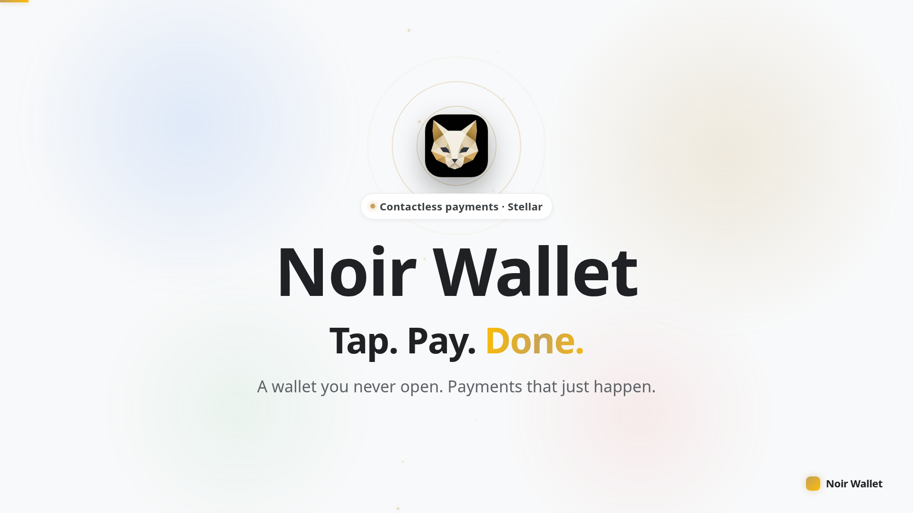
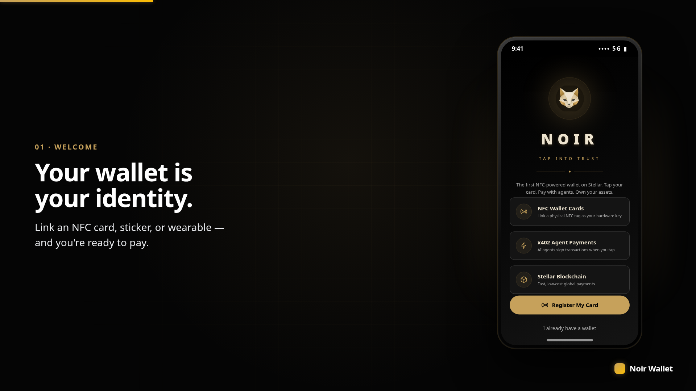
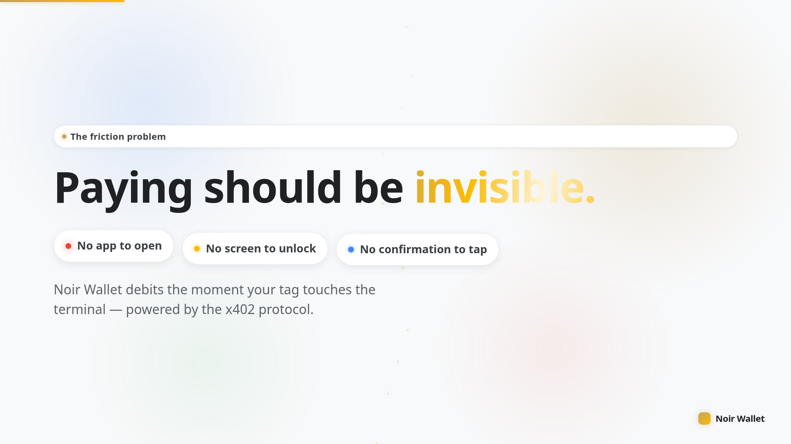
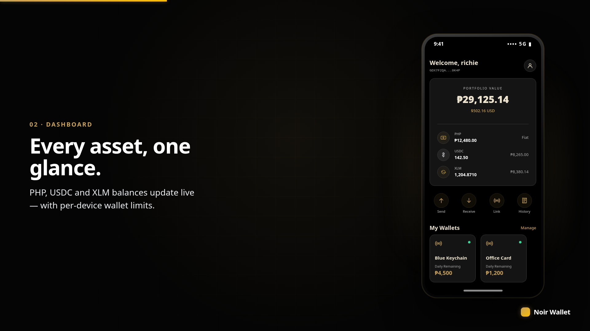
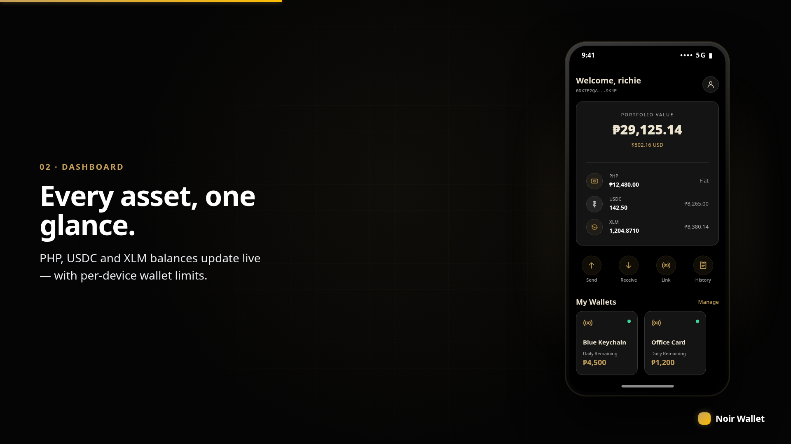
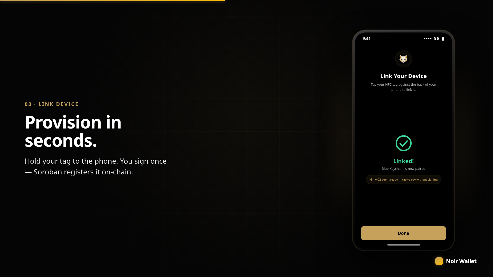
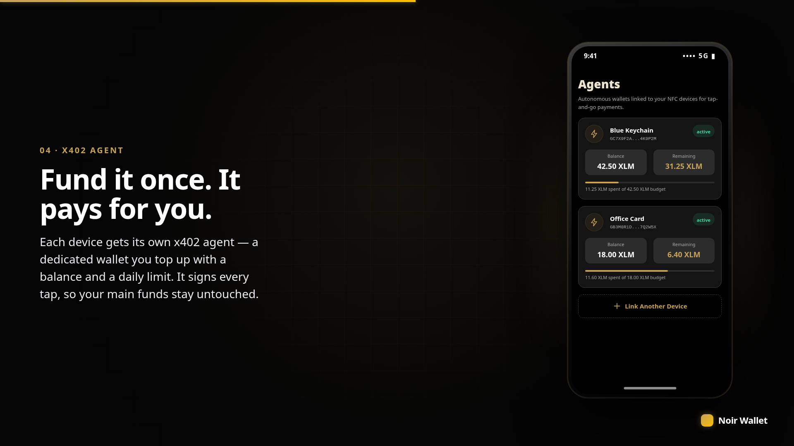
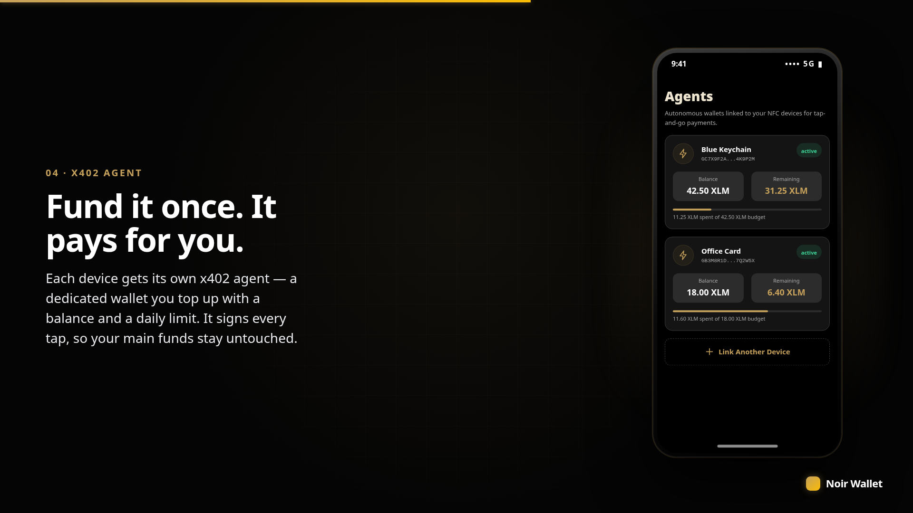
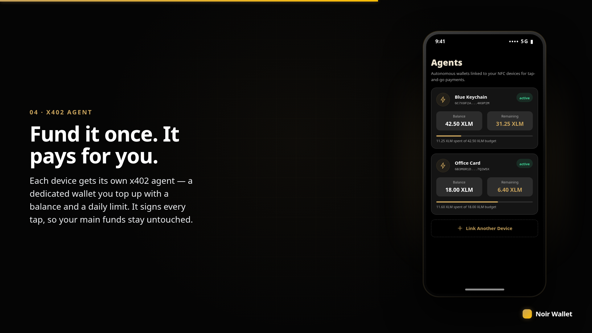

# Noir Wallet

**x402 — Contactless payments powered by Stellar. No app opens. No confirmation. Just tap and go.**

**Hackathon Track:** Payment & Consumer Applications

> 📊 **[View Pitch Deck](ppt/Noir-Wallet-Pitch.pptx)** — Slide deck covering the product, architecture, market, and demo walkthrough.

## Screenshots

<div align="center">











</div>

## Demo

<div align="center">

<video src="https://github.com/rylsherdamz-rgb/Noir_Wallet/raw/main/assets/noir-demo.mp4" poster="assets/noir-demo-poster.jpg" controls muted width="820">
  Your browser can't play this video.
  <a href="https://github.com/rylsherdamz-rgb/Noir_Wallet/raw/main/assets/noir-demo.mp4">Download / watch the demo (MP4)</a>.
</video>

<em>▶ A 95-second, Google-style product walkthrough — narrated voiceover, the x402 tap-to-pay flow, per-device agent wallets, and the full mobile app. Built with Remotion.</em>

</div>

## Project Description

Noir Wallet implements the **x402 protocol** — a zero-interaction payment flow where the wallet is debited immediately upon hardware tap. The user never unlocks their phone, opens an app, or confirms a transaction. The payment terminal reads the device UID, resolves the linked Stellar wallet, and executes the transfer in under 2 seconds.

Built for high-throughput environments: transit turnstiles, campus canteens, event gates, and retail checkout.

## Project Vision

A world where:
- Your wallet is your identity — linked to an RFID sticker, NFC card, or wearable
- Payments happen without friction — no app, no confirmation, no delay
- Settlement is instant — powered by Stellar consensus
- Merchants settle in their preferred currency — via the PDAX fiat bridge

## Key Features

- **Zero-Interaction Payments**: Tap any RFID sticker, NFC card, or wearable to pay instantly
- **x402 Protocol**: Wallet debited on hardware tap — no unlock, no app, no confirmation
- **Stellar-Powered**: Fast, low-cost settlement via the Stellar network
- **Soroban Smart Contracts**: `device_registry` for hardware-to-wallet mapping
- **Wallet-Authorized Registration**: Device owners sign their own registration via `wallet.require_auth()`
- **PDAX Fiat Bridge**: Two-way PHP ↔ USDC bridge — cash-in (PHP → USDC to wallet) and cash-out (USDC → PHP)
- **Fee-Bump Channels**: Card wallets never hold XLM for fees — a rotating pool of channel accounts fee-bumps every tap
- **Custom Agents**: Per-device agent wallets with independent balances
- **NFC Provisioning**: Link new devices directly from the app
- **Dark Theme**: Premium noir aesthetic with gold accents
- **Cross-Platform**: React Native Expo app for iOS and Android

## Tech Stack

| Layer | Technology |
|-------|-----------|
| Blockchain | Stellar (testnet / mainnet) |
| Smart Contracts | Soroban (Rust) |
| Frontend | React Native, Expo 57, TypeScript |
| Styling | NativeWind, Tailwind CSS |
| State | Zustand |
| NFC | react-native-nfc-manager |
| Wallet SDK | @stellar/stellar-sdk v16 |
| Testing | Vitest |
| Contract Dev | soroban-cli, Rust nightly |

## Architecture

```
RFID / NFC Tag
    |
    v
Mobile App / POS Terminal
    |
    ├── NFC read → SHA-256 hash device UID
    ├── x402 Agent (per-device signing key)
    └── Soroban Contract (device_registry)
           |
           v
    Stellar Network  ──>  Merchant Settlement
           |
           v
    PDAX Fiat Bridge (PHP Cash-out)
```

### Smart Contracts

| Contract | Description | Auth | Location |
|----------|-------------|------|----------|
| **device_registry** | Maps hardware device hashes to Stellar wallet addresses | `wallet.require_auth()` | `backend/asset/contracts/device_registry/` |

**Testnet Contract ID:** `CC2EBXO3BGFSFCM3DKYI4VFT7DYFFEK7YAGIGFFNLSPFRJ2QKITAQIEC`

### Contract Methods

| Method | Args | Description |
|--------|------|-------------|
| `initialize` | `admin: Address` | Set contract admin (called once) |
| `register` | `device_hash: BytesN<32>, wallet: Address` | Register a device to a wallet |
| `unregister` | `device_hash: BytesN<32>` | Remove a device (admin only) |
| `get_wallet` | `device_hash: BytesN<32>` | Look up wallet by device hash |

## Settlement

Every tap runs through the payment gateway (`backend/asset/backend`, Rust + actix-web) before it ever touches Stellar:

1. **Hash & de-dupe** — the device serial is SHA-256 hashed, and the request's `idempotency_key` is checked against prior transactions first. A retried tap replays the stored result instead of double-charging.
2. **Rate limit & spend check** — a per-device rate limiter and daily spend-limit validator reject taps that come in too fast or exceed the card's configured budget.
3. **PIN step-up above 10 XLM** — cards with a PIN on file require it for any single payment over 10 XLM (`PIN_REQUIRED_ABOVE_STROOPS`), so a cloned or stolen UID alone can't move large sums.
4. **Sign & fee-bump** — the card's Stellar keypair is decrypted from encrypted-at-rest custody and signs the payment; a rotating **fee channel** (`FeeChannelManager`) fee-bumps the transaction so the card wallet never needs to hold XLM for fees.
5. **Submit & settle** — the fee-bumped envelope is submitted to Stellar and confirmed by a background poller (`workers/confirmation_poller.rs`); the frontend gets `202 Accepted` immediately and polls `/payment/{transaction_id}` for final status.

### Endpoints

| Route | Method | Description |
|-------|--------|-------------|
| `/payment/tap` | POST | The x402 tap-to-pay flow described above |
| `/payment` | POST | Direct payment submission |
| `/payment/{transaction_id}` | GET | Poll settlement status |
| `/payments/initiate` | POST | Frontend-initiated payment (202 async) |
| `/payments/batch` | POST | Batch submission for the offline queue |
| `/channels` / `/channels/{address}` | GET | Fee channel pool status and balances |
| `/pdax/cash-in` | POST | PHP → USDC: firm quote, order, withdraw to wallet |
| `/pdax/cash-out` | POST | USDC → PHP: liquidate crypto back to fiat |
| `/devices/register`, `/cards/provision`, `/cards/revoke` | POST | Device/card lifecycle |

### PDAX Fiat Bridge

Cash-in and cash-out both go through PDAX's quote → order → withdraw flow (`src/pdax.rs`): a firm quote is requested for the PHP/USDC pair, an order is placed with a fresh idempotency ID, and — for cash-in — USDC is withdrawn on-chain straight to the user's Stellar wallet.

## Project Structure

```
Noir_Wallet/
├── frontend/                # React Native Expo application
│   └── src/
│       ├── screens/         # Dashboard, POS, Device Provisioning, Agents, etc.
│       ├── components/      # BalanceCard, NumericKeypad, ReadyToTap, etc.
│       ├── services/        # Stellar SDK, NFC, API client
│       ├── store/           # Zustand state management
│       ├── hooks/           # useNfc, useProfile, custom hooks
│       ├── lib/             # soroban.ts helpers, x402 auth
│       ├── domain/          # x402 agent logic
│       ├── constants/       # Theme (black/gold), network config
│       └── types/           # TypeScript type definitions
├── backend/                 # Soroban smart contracts (Rust)
│   └── asset/
│       └── contracts/device_registry/
├── assets/                  # Demo video, poster, branding
├── images/                  # Screenshots & diagrams
├── promo/                   # Promotional materials
├── models/                  # ML / design models
├── old/                     # Archived code (backward compat)
└── contextimages/           # Design inspiration and moodboards
```

## Security

- **Hashed device identity** — raw NFC/RFID UIDs are never stored; every lookup uses a SHA-256 hash of the serial (`hash_device_serial`)
- **Idempotency keys** — every tap carries a client-generated key; a replayed request returns the original result instead of re-charging
- **Per-device rate limiting** — the gateway's `rate_limiter` rejects taps that arrive faster than the configured window, blocking double-tap and brute-force patterns
- **Spend-limit enforcement** — `validator.validate_spend_limit()` checks each payment against the card's daily budget before it's signed
- **PIN step-up** — a second factor is required for any single tap above 10 XLM
- **Encrypted-at-rest custody** — card signing keys are decrypted on demand via a KMS-backed `KeyManager` (`crypto::decrypt_at_rest`), never stored in plaintext
- **API key middleware** — every gateway request is authenticated at the HTTP layer before it reaches a handler
- **Wallet-authorized on-chain registration** — device linking on Soroban requires `wallet.require_auth()`, so only the wallet owner can register their own device

## Future Improvements

Two additional Soroban contracts are scoped to close the remaining gaps between what the gateway already enforces off-chain and what's verifiable on-chain — and to give the deployed contract surface (currently just `device_registry`) more weight for a mainnet/production ask:

- **`terminal_registry`** — on-chain whitelisting for POS terminals (`register_terminal`, `authorized_terminals`), so only approved hardware can trigger a payment resolution. Pairs with **signed NFC taps**: each tap includes a terminal-signed nonce that the contract verifies, moving replay protection from the gateway's in-memory rate limiter into an on-chain, auditable guarantee (`last_tx_at` per device). This is the feature most worth funding — it's the difference between "we trust our own backend" and "the chain itself rejects a replayed or spoofed tap."
- **`settlement`** — on-chain merchant settlement/escrow that ties a batch of confirmed payments to a PDAX cash-out reference, so merchants can verify their payout on-chain instead of trusting the gateway's ledger alone.

Together with `device_registry`, this brings the contract surface to three — each with a distinct, auditable responsibility (identity, terminal trust, settlement).

## Device Provisioning Flow

1. Open the app and tap **Link Device**
2. Hold your NFC tag against the phone
3. App reads the tag UID and writes wallet info to the tag
4. A **signature prompt** appears with transaction details
5. Tap **Sign** — the app SHA-256 hashes your tag UID, calls `device_registry.register()` on Soroban, and polls for confirmation
6. Device is linked and registered on-chain

## Getting Started

### Prerequisites
- Node.js 26+
- Expo CLI (`npm install -g expo-cli`)
- iOS Simulator (macOS) or Android Emulator / device
- Stellar testnet wallet (Freighter extension or custom)
- Rust toolchain (for contract development)

### Setup

```bash
# Clone and install
git clone https://github.com/rylsherdamz-rgb/Noir_Wallet.git
cd Noir_Wallet/frontend
npm install
```

### Environment

Copy `.env.example` to `.env` and configure:

| Variable | Description | Current Value |
|----------|-------------|---------------|
| `EXPO_PUBLIC_DEVICE_REGISTRY_CONTRACT` | Soroban device registry contract ID | `CC2EBXO3BGFSFCM3DKYI4VFT7DYFFEK7YAGIGFFNLSPFRJ2QKITAQIEC` |
| `EXPO_PUBLIC_STELLAR_MASTER_KEY_ID` | Stellar master key ID | (configure per deployment) |
| `EXPO_PUBLIC_CHANNEL_SECRET_KEY` | Fee channel secret | (configure per deployment) |
| `EXPO_PUBLIC_ISSUER_ADDRESS` | Asset issuer address | (configure per deployment) |
| `EXPO_PUBLIC_PDAX_API_KEY` | PDAX sandbox/prod API key | (optional) |
| `EXPO_PUBLIC_TERMINAL_ID` | x402 Terminal ID | (optional) |

### Run Development Server

```bash
cd frontend
npx expo start
```

Scan the QR code with Expo Go, or press `a` for Android / `i` for iOS simulator.

### Smart Contract Development

```bash
cd backend/asset/contracts/device_registry

# Build WASM
cargo build --release --target wasm32-unknown-unknown

# Run unit tests (requires Stellar test environment)
cargo test --package device-registry

# Deploy with soroban-cli
soroban contract deploy \
  --wasm target/wasm32-unknown-unknown/release/device_registry.wasm \
  --network testnet
```

### Run Tests

```bash
cd frontend
npm test
```


## Team

| Role | Name |
|------|------|
| Fullstack Developer | Richie Christian De Guzman |
| Backend Developer | Johnrick Rabara |
| UI/UX Designer | Jefferson Tuparan |

## License

MIT
