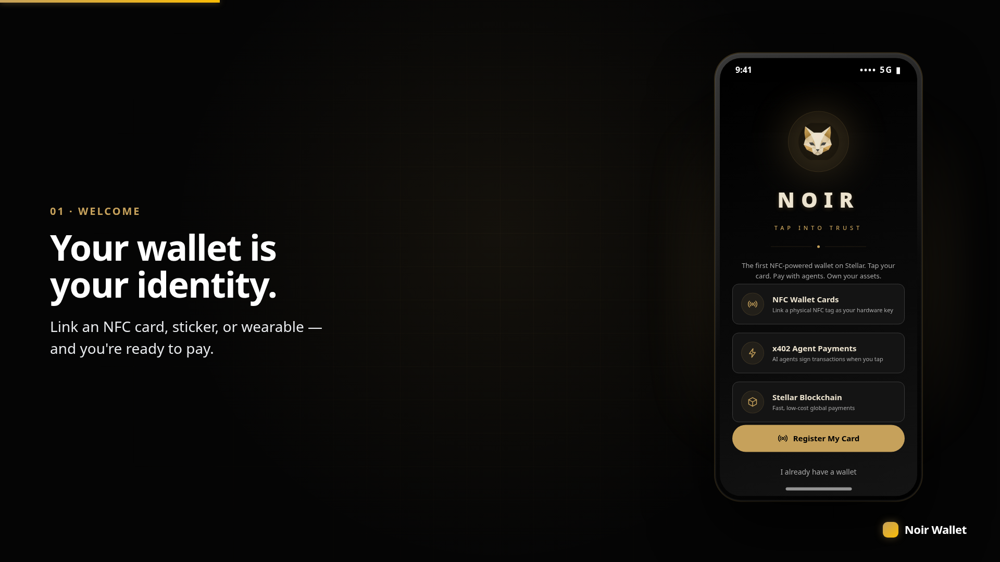
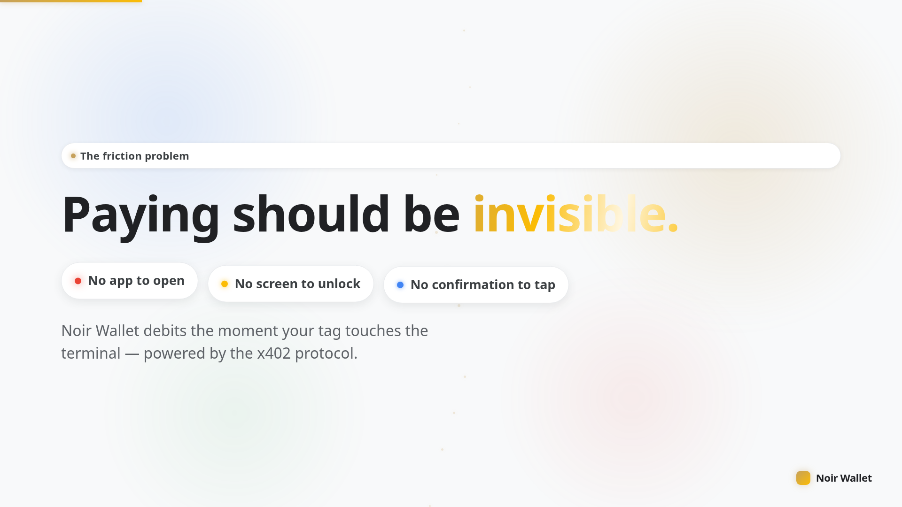
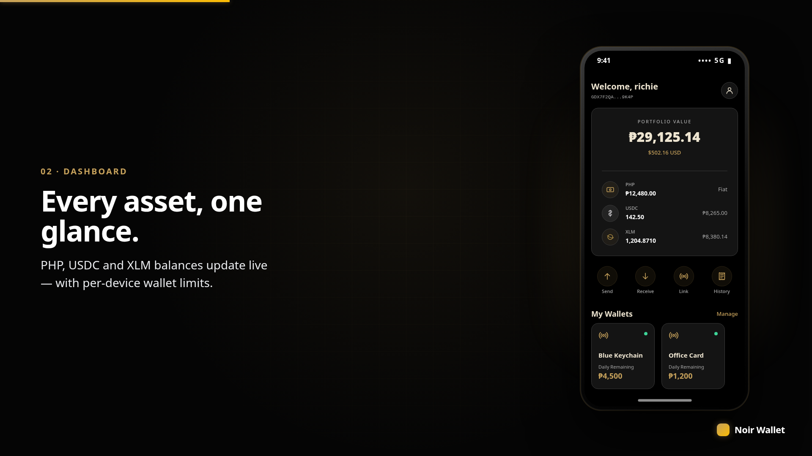
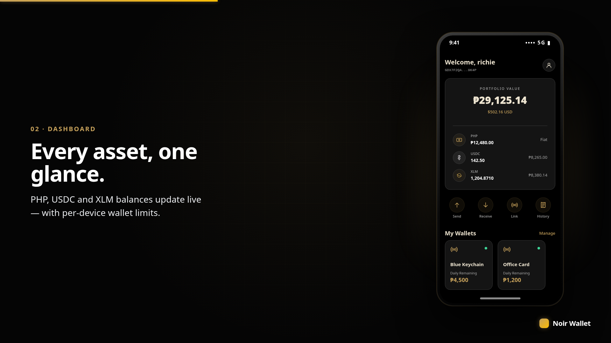
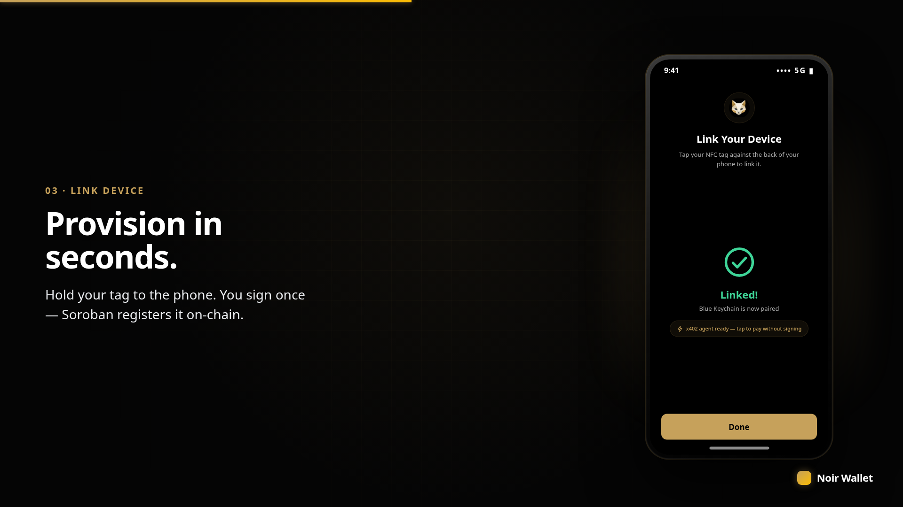
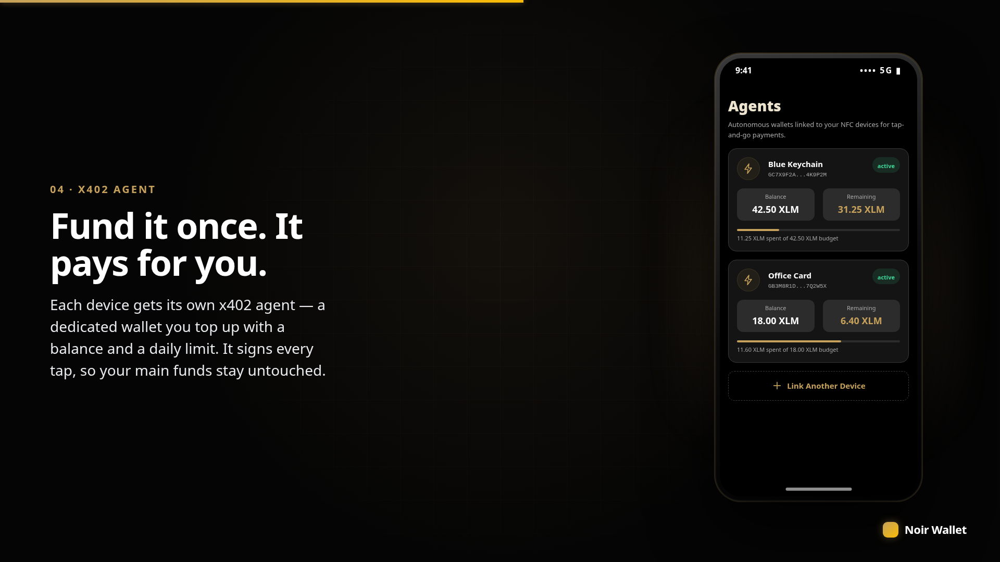
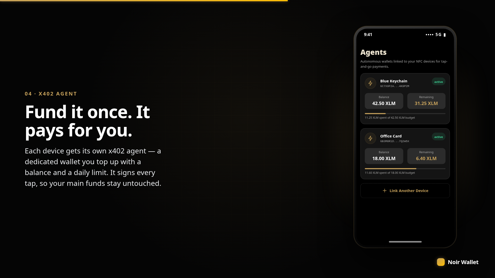
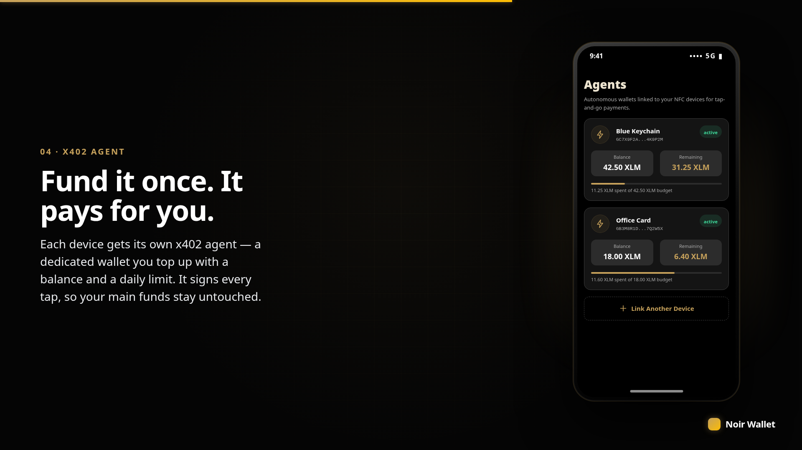

# Noir Wallet

**x402 — Contactless payments powered by Stellar. No app opens. No confirmation. Just tap and go.**

> 📊 **[View Pitch Deck](ppt/Noir-Wallet-Pitch.pptx)** — Slide deck covering the product, architecture, market, and demo walkthrough.

## Screenshots

<div align="center">










</div>

## Demo

<div align="center">

<video src="assets/x-demo.mp4" width="100%" controls style="max-width:960px;border-radius:16px;border:1px solid #3A3A3A;box-shadow:0 8px 32px rgba(0,0,0,0.5)">
  Your browser does not support the video tag.
</video>

<em>▶ Demo — tap-to-pay with the x402 protocol, per-device agent wallets, and the full mobile app. [Original X post](https://x.com/ChichiCode0/status/2083815952635093215)</em>

<video src="assets/noir-demo.mp4" width="100%" controls style="max-width:960px;border-radius:16px;border:1px solid #3A3A3A;box-shadow:0 8px 32px rgba(0,0,0,0.5)">
  Your browser does not support the video tag.
</video>

<em>▶ A 95-second, Google-style product walkthrough — narrated voiceover, the x402 tap-to-pay flow, per-device agent wallets, and the full mobile app.</em>

</div>

## Project Description

Noir Wallet implements the **x402 protocol** — a zero-interaction payment flow where the wallet is debited immediately upon hardware tap. The user never unlocks their phone, opens an app, or confirms a transaction. The payment terminal reads the device UID, resolves the linked Stellar wallet, and executes the transfer in under 2 seconds.

Built for high-throughput environments: transit turnstiles, campus canteens, event gates, and retail checkout.

## Project Vision

A world where:
- Your wallet is your identity — linked to an RFID sticker, NFC card, or wearable
- Payments happen without friction — no app, no confirmation, no delay
- Settlement is instant — powered by Stellar consensus
- Merchants settle in their preferred currency — via the PDAX fiat bridge

## Key Features

- **Zero-Interaction Payments**: Tap any RFID sticker, NFC card, or wearable to pay instantly
- **x402 Protocol**: Wallet debited on hardware tap — no unlock, no app, no confirmation
- **Stellar-Powered**: Fast, low-cost settlement via the Stellar network
- **Soroban Smart Contracts**: `device_registry` for hardware-to-wallet mapping
- **Wallet-Authorized Registration**: Device owners sign their own registration via `wallet.require_auth()`
- **PDAX Fiat Bridge**: Optional PHP cash-out via PDAX integration
- **Custom Agents**: Per-device agent wallets with independent balances
- **NFC Provisioning**: Link new devices directly from the app
- **Dark Theme**: Premium noir aesthetic with gold accents
- **Cross-Platform**: React Native Expo app for iOS and Android

## Tech Stack

| Layer | Technology |
|-------|-----------|
| Blockchain | Stellar (testnet / mainnet) |
 | Smart Contracts | Soroban (Rust) — 3 contracts |
| Frontend | React Native, Expo 57, TypeScript |
| Styling | NativeWind, Tailwind CSS |
| State | Zustand |
| NFC | react-native-nfc-manager |
| Wallet SDK | @stellar/stellar-sdk v16 |
| Testing | Vitest |
| Contract Dev | soroban-cli, Rust nightly |

## Architecture

```
RFID / NFC Tag
    |
    v
Mobile App / POS Terminal
    |
    ├── NFC read → SHA-256 hash device UID
    ├── x402 Agent (per-device signing key)
    └── Soroban Contracts
           |
           ├── device_registry  ──>  Map device hash → wallet
           ├── agent_registry   ──>  Authorize agent per device
           └── payment_escrow   ──>  Pre-funded escrow → instant authorize
                  |
                  v
           Stellar Network
                  |
           ┌──────┴──────┐
           v             v
     Merchant claim   PDAX Fiat Bridge
     (batch settle)   (PHP Cash-out)
```

### Smart Contracts

 | Contract | Description | Auth | Location |
|----------|-------------|------|----------|
| **device_registry** | Maps hardware device hashes to Stellar wallet addresses | `wallet.require_auth()` | `backend/asset/contracts/device_registry/` |
| **agent_registry** | On-chain agent authorization per device — allows wallet owner to authorize a signing key for tap-to-pay | `wallet.require_auth()` | `backend/asset/contracts/agent_registry/` |
| **payment_escrow** | Escrow-based settlement — wallet pre-funds, agent authorizes payments instantly, merchants claim in batch | agent auth (via `agent_registry`) | `backend/asset/contracts/payment_escrow/` |

**Testnet Contract IDs** (redeployed 2026-08-08):

| Contract | ID | Explorer |
|----------|----|----------|
| device_registry | `CC7BV6ULIW3LZ53I2MIK45GISQYIMWX2VCNVHWJKEWT6SNOP7KIHBVMQ` | [view](https://stellar.expert/explorer/testnet/contract/CC7BV6ULIW3LZ53I2MIK45GISQYIMWX2VCNVHWJKEWT6SNOP7KIHBVMQ) |
| agent_registry | `CCDMVM2DVK7P7R4TGNBA6DC5D57QAQN4MJXK7WPLTEEGL4UOQUCCTQS2` | [view](https://stellar.expert/explorer/testnet/contract/CCDMVM2DVK7P7R4TGNBA6DC5D57QAQN4MJXK7WPLTEEGL4UOQUCCTQS2) |
| payment_escrow | `CA4R4676IS72T2IVDTJKQB247KCZLGHDGRG3DUP2NKI3OBHBGA6CLQMQ` | [view](https://stellar.expert/explorer/testnet/contract/CA4R4676IS72T2IVDTJKQB247KCZLGHDGRG3DUP2NKI3OBHBGA6CLQMQ) |

**Mainnet Contract IDs** (deployed 2026-07-18):

| Contract | ID | Explorer |
|----------|----|----------|
| device_registry | `CDSURGM4LYYRZ6U4RKBRUQPA7SGLAJZ5XXS65ACYCIU6QOO2NEEA2S45` | [view](https://stellar.expert/explorer/public/contract/CDSURGM4LYYRZ6U4RKBRUQPA7SGLAJZ5XXS65ACYCIU6QOO2NEEA2S45) |
| agent_registry | `CDE2Q22BNKHLRNHUXHNL4TYRN5YPCOCO2XD53MAVYG7K2C4KZ2T6NI5T` | [view](https://stellar.expert/explorer/public/contract/CDE2Q22BNKHLRNHUXHNL4TYRN5YPCOCO2XD53MAVYG7K2C4KZ2T6NI5T) |
| payment_escrow | `CCEIB2BLMHK7N7OX23HJ3RCMJBP2NLBMMBGUA6SB5IWJJ6JEWH6ZZPK3` | [view](https://stellar.expert/explorer/public/contract/CCEIB2BLMHK7N7OX23HJ3RCMJBP2NLBMMBGUA6SB5IWJJ6JEWH6ZZPK3) |

### Contract Methods

#### device_registry
| Method | Args | Description |
|--------|------|-------------|
| `initialize` | `admin: Address` | Set contract admin (called once) |
| `register` | `device_hash: BytesN<32>, wallet: Address` | Register a device to a wallet |
| `unregister` | `device_hash: BytesN<32>` | Remove a device (admin only) |
| `get_wallet` | `device_hash: BytesN<32>` | Look up wallet by device hash |

#### agent_registry
| Method | Args | Description |
|--------|------|-------------|
| `initialize` | `admin: Address` | Set contract admin (called once) |
| `register_agent` | `wallet: Address, device_hash: BytesN<32>, agent: Address` | Authorize agent for device |
| `revoke_agent` | `wallet: Address, device_hash: BytesN<32>` | Revoke agent access |
| `get_agent` | `device_hash: BytesN<32>` | Look up agent by device hash |
| `is_auth` | `device_hash: BytesN<32>, agent: Address` | Check if agent is authorized |

#### payment_escrow
| Method | Args | Description |
|--------|------|-------------|
| `initialize` | `admin: Address, agent_registry_id: Address` | Set admin + link to agent_registry |
| `fund_escrow` | `token: Address, wallet: Address, device_hash: BytesN<32>, amount: i128` | Deposit into escrow for a device |
| `authorize` | `agent: Address, device_hash: BytesN<32>, merchant: Address, amount: i128` | Instant payment auth from escrow |
| `claim` | `token: Address, merchant: Address` | Batch-claim all pending payments |
| `defund_escrow` | `token: Address, device_hash: BytesN<32>, amount: i128` | Wallet reclaims unused escrow funds |
| `balance_of` | `device_hash: BytesN<32>` | Check escrow balance |
| `pending_balance` | `merchant: Address` | Check unclaimed payments |

## Project Structure

```
Noir_Wallet/
├── frontend/                # React Native Expo application
│   └── src/
│       ├── screens/         # Dashboard, POS, Device Provisioning, Agents, etc.
│       ├── components/      # BalanceCard, NumericKeypad, ReadyToTap, etc.
│       ├── services/        # Stellar SDK, NFC, API client
│       ├── store/           # Zustand state management
│       ├── hooks/           # useNfc, useProfile, custom hooks
│       ├── lib/             # soroban.ts helpers, x402 auth
│       ├── domain/          # x402 agent logic
│       ├── constants/       # Theme (black/gold), network config
│       └── types/           # TypeScript type definitions
├── backend/                 # Soroban smart contracts (Rust)
│   └── asset/
│           ├── contracts/device_registry/
│           ├── contracts/agent_registry/
│           └── contracts/payment_escrow/
├── assets/                  # Demo video, poster, branding
├── images/                  # Screenshots & diagrams
├── promo/                   # Promotional materials
├── models/                  # ML / design models
├── old/                     # Archived code (backward compat)
└── contextimages/           # Design inspiration and moodboards
```

## Device Provisioning Flow

1. Open the app and tap **Link Device**
2. Hold your NFC tag against the phone
3. App reads the tag UID and writes wallet info to the tag
4. A **signature prompt** appears with transaction details
5. Tap **Sign** — the app SHA-256 hashes your tag UID, calls `device_registry.register()` on Soroban, and polls for confirmation
6. x402 agent wallet is created and funded via Friendbot
7. Wallet owner signs `agent_registry.register_agent()` to authorize the agent for this device
8. Device is linked, agent authorized, and ready for tap-to-pay

## Escrow Payment Flow

1. **Pre-fund:** Wallet owner deposits XLM into `payment_escrow` (one-time, per device)
2. **Tap:** Agent reads NFC → SHA-256 hash → calls `payment_escrow.authorize(merchant, amount)` 
3. **Instant:** Funds are deducted from escrow balance and locked for the merchant — no Horizon submission, no per-tap fee
4. **Settle:** Merchant calls `payment_escrow.claim()` in batch — one transaction claims all pending payments
5. **Reclaim:** Wallet owner can `defund_escrow()` unused balance at any time

## Getting Started

### Prerequisites
- Node.js 26+
- Expo CLI (`npm install -g expo-cli`)
- iOS Simulator (macOS) or Android Emulator / device
- Stellar testnet wallet (Freighter extension or custom)
- Rust toolchain (for contract development)

### Setup

```bash
# Clone and install
git clone https://github.com/rylsherdamz-rgb/Noir_Wallet.git
cd Noir_Wallet/frontend
npm install
```

### Environment

Copy `.env.example` to `.env` and configure:

| Variable | Description | Current Value |
|----------|-------------|---------------|
| `EXPO_PUBLIC_DEVICE_REGISTRY_CONTRACT` | Soroban device registry contract ID | `CC7BV6ULIW3LZ53I2MIK45GISQYIMWX2VCNVHWJKEWT6SNOP7KIHBVMQ` |
| `EXPO_PUBLIC_AGENT_REGISTRY_CONTRACT` | Soroban agent registry contract ID | `CCDMVM2DVK7P7R4TGNBA6DC5D57QAQN4MJXK7WPLTEEGL4UOQUCCTQS2` |
| `EXPO_PUBLIC_PAYMENT_ESCROW_CONTRACT` | Soroban payment escrow contract ID | `CA4R4676IS72T2IVDTJKQB247KCZLGHDGRG3DUP2NKI3OBHBGA6CLQMQ` |
| `EXPO_PUBLIC_STELLAR_MASTER_KEY_ID` | Stellar master key ID | (configure per deployment) |
| `EXPO_PUBLIC_CHANNEL_SECRET_KEY` | Fee channel secret | (configure per deployment) |
| `EXPO_PUBLIC_ISSUER_ADDRESS` | Asset issuer address | (configure per deployment) |
| `EXPO_PUBLIC_PDAX_API_KEY` | PDAX sandbox/prod API key | (optional) |
| `EXPO_PUBLIC_TERMINAL_ID` | x402 Terminal ID | (optional) |

### Run Development Server

```bash
cd frontend
npx expo start
```

Scan the QR code with Expo Go, or press `a` for Android / `i` for iOS simulator.

### Smart Contract Development

```bash
cd backend/asset

# Build all WASM
cargo build --release --target wasm32v1-none -p device-registry -p agent-registry -p payment-escrow

# Run checks (host target)
cargo check -p device-registry -p agent-registry -p payment-escrow

# Deploy to testnet (one per contract)
soroban contract deploy \
  --wasm target/wasm32v1-none/release/device_registry.wasm \
  --network testnet

soroban contract deploy \
  --wasm target/wasm32v1-none/release/agent_registry.wasm \
  --network testnet

soroban contract deploy \
  --wasm target/wasm32v1-none/release/payment_escrow.wasm \
  --network testnet

# Initialize contracts
soroban contract invoke --id <DEVICE_REGISTRY_ID> --network testnet -- \
  initialize --admin <ADMIN_ADDR>

soroban contract invoke --id <AGENT_REGISTRY_ID> --network testnet -- \
  initialize --admin <ADMIN_ADDR>

soroban contract invoke --id <ESCROW_ID> --network testnet -- \
  initialize --admin <ADMIN_ADDR> --agent_registry_id <AGENT_REGISTRY_ID>
```

### Run Tests

```bash
cd frontend
npm test
```

## User Feedback

We collected structured feedback from **60 testers** who registered devices, funded escrows, and completed payment flows on Stellar testnet. The results shaped our roadmap — here's what mattered most to them.

**Top requested improvements:**

| Rank | Request | Why it mattered |
|------|---------|-----------------|
| 1 | **Onboarding tutorial** | Step-by-step guide for device provisioning and first payment |
| 2 | **QR code scanner** | Scan wallet addresses on receive and send screens |
| 3 | **Dark mode toggle** | Theme switch for late-night use |
| 4 | **Transaction search & filters** | Find payments by date, amount, or counterparty |
| 5 | **Push notifications** | Payment confirmations and escrow alerts |
| 6 | **Better empty states** | Sample data or guided prompts on first launch |
| 7 | **Haptic feedback** | Vibration on successful NFC tap |
| 8 | **Custom NFC device names** | Rename tags instead of showing hashes |
| 9 | **Multi-currency display** | Show USD/PHP equivalent alongside XLM |
| 10 | **Spending limits per device** | Configurable per-NFC-card budgets |

> 💡 All ten improvements are shortlisted for the v1 roadmap — starting with the onboarding tutorial and NFC device naming.

## Team

| Role | Name |
|------|------|
| Fullstack Developer | Richie Christian De Guzman |
| Backend Developer | Johnrick Rabara |
| UI/UX Designer | Jefferson Tuparan |

## License

MIT
