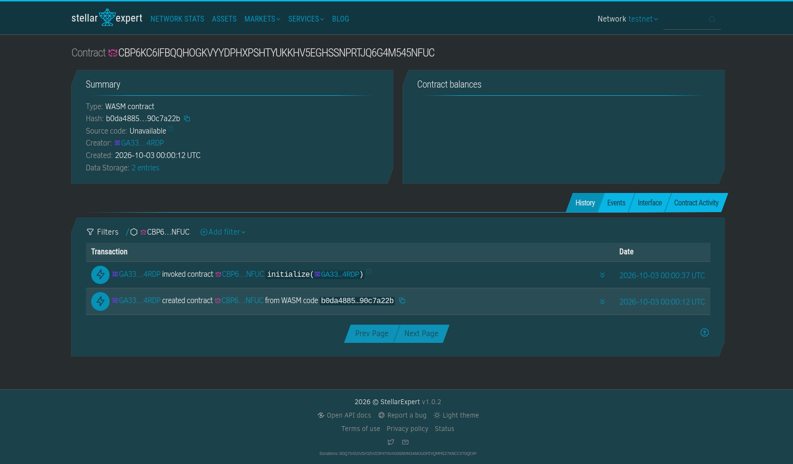
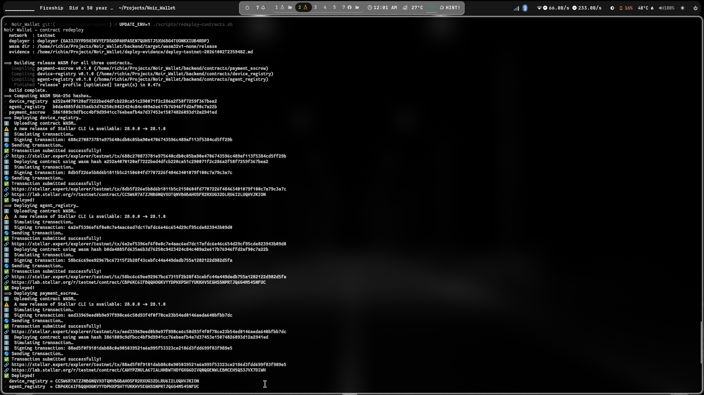
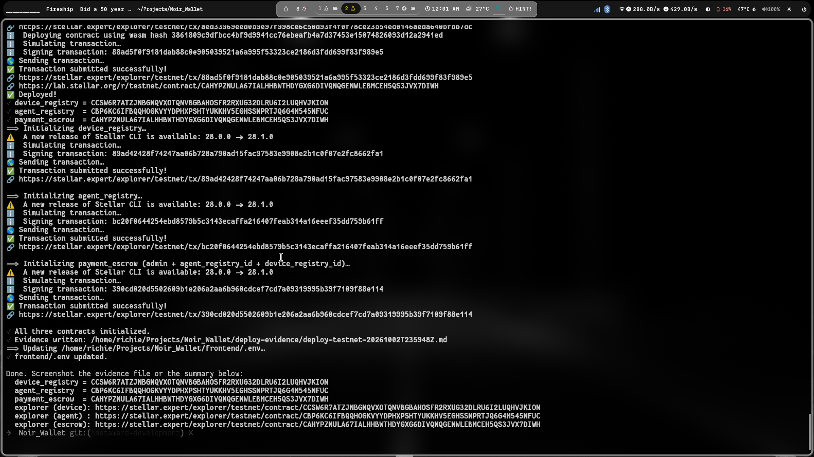
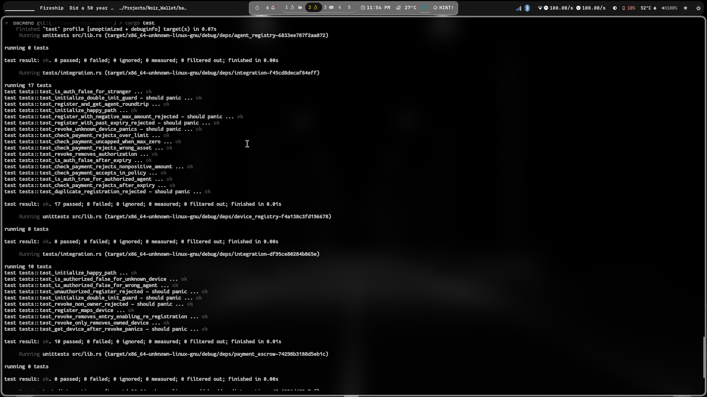
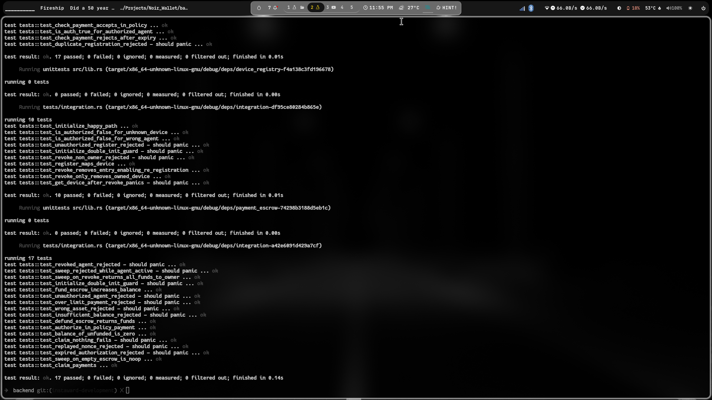

# On-Chain Deployment Evidence — Testnet

Visual proof that the three Noir Wallet Soroban contracts are deployed,
initialized, and verifiable on Stellar testnet. These screenshots back the
contract IDs listed in the [root README](../../README.md#smart-contracts) and
the machine-readable record in
[`deploy-evidence/deploy-testnet-20261007T050558Z.md`](../../deploy-evidence/deploy-testnet-20261007T050558Z.md).

> **Why these IDs change:** each `./scripts/redeploy-contracts.sh` run deploys
> **fresh contract instances**, so every redeploy mints **new contract IDs** —
> it is a clean slate, not an in-place upgrade. The IDs below are from the
> latest run (2026-10-07, deployer `GA33JXYP…4RDP`).
>
> Note: the explorer screenshot filenames below still show the 2026-10-01
> contract IDs (`CCSW6R7A…`, `CBP6KC6I…`, `CAHYPZNU…`) — they predate this
> redeploy and have not been retaken against the current IDs.

## Deployed contracts

| Contract | ID | Explorer |
|----------|----|----------|
| device_registry | `CB4DPMGOA374JIB2ZVD4AHW5GJKQUYNOFGRYNOJ75EFH2KCJSMHOWIRA` | [view](https://stellar.expert/explorer/testnet/contract/CB4DPMGOA374JIB2ZVD4AHW5GJKQUYNOFGRYNOJ75EFH2KCJSMHOWIRA) |
| agent_registry | `CBTDMJVCFQDIVWZBKAKZ2FQ3UEJNAAUFYCTJ3E4ON2MYXPLPSIXQ25JZ` | [view](https://stellar.expert/explorer/testnet/contract/CBTDMJVCFQDIVWZBKAKZ2FQ3UEJNAAUFYCTJ3E4ON2MYXPLPSIXQ25JZ) |
| payment_escrow | `CA5S4S7QGHJHJWVJBYL3CXZXZTNGKXMNZVDAEQNN7NUXFP4D7BYK7HIX` | [view](https://stellar.expert/explorer/testnet/contract/CA5S4S7QGHJHJWVJBYL3CXZXZTNGKXMNZVDAEQNN7NUXFP4D7BYK7HIX) |

### WASM SHA-256 hashes

The hash of each deployed WASM — recompute locally with `sha256sum` on the
release build and it must match, proving the on-chain code is exactly what's in
this repo.

| Contract | SHA-256 |
|----------|---------|
| device_registry.wasm | `a252a4070120af7222bed4dfcb220ca51c290071f2c286a2f58f7259f367bea2` |
| agent_registry.wasm | `b0da4885fd635a6b3d76250c9423424c84c409a2e617b76946ffd2af90c7a22b` |
| payment_escrow.wasm | `3861809c9dfbcc4bf9d9941cc76ebeafb4a7d37453e15074826093d12a2941ed` |

## Wallet create / import (Android)

Screenshots of import → wallet password → wallet → password lock on a release build:
[`wallet/README.md`](wallet/README.md). Live Testnet run of create/import, device +
agent registration, escrow fund/withdraw and unlink, with tx links:
`deploy-evidence/week2-testnet-flow-*.md`.

## Explorer screenshots

### device_registry — `CCSW6R7A…`

Stellar Expert view of the deployed device registry: maps hardware device
hashes to the owner wallet and its authorized agent.

### agent_registry — `CBP6KC6I…`

The agent registry holding each device's constrained delegated-payment policy
(agent key, per-tap cap, allowed asset, expiry).

### payment_escrow — `CAHYPZNU…`

The escrow contract that pre-funds a device, authorizes payments instantly
against the agent policy, and lets merchants batch-claim.

## Deployment console output

The redeploy script's deploy + initialize output, showing the freshly minted
contract addresses.

## Test suite

All contract tests passing (positive and negative paths) prior to deployment.

