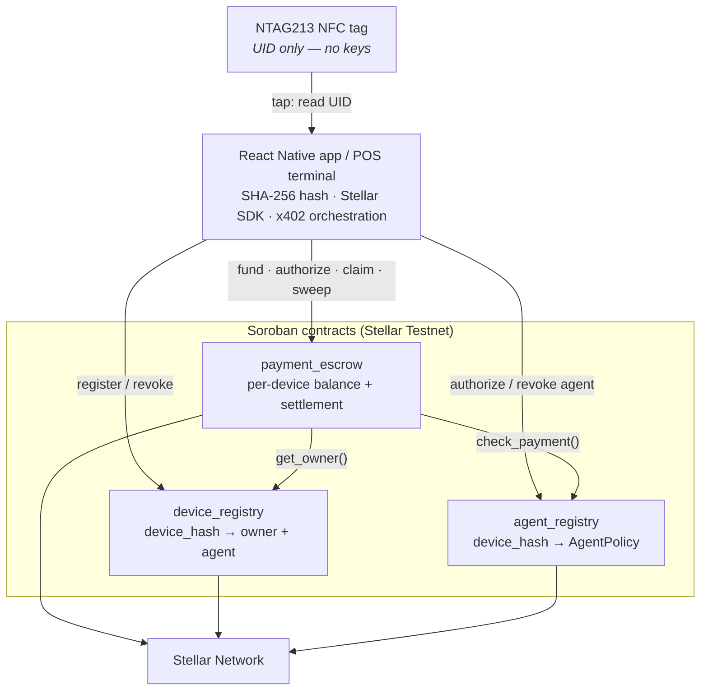
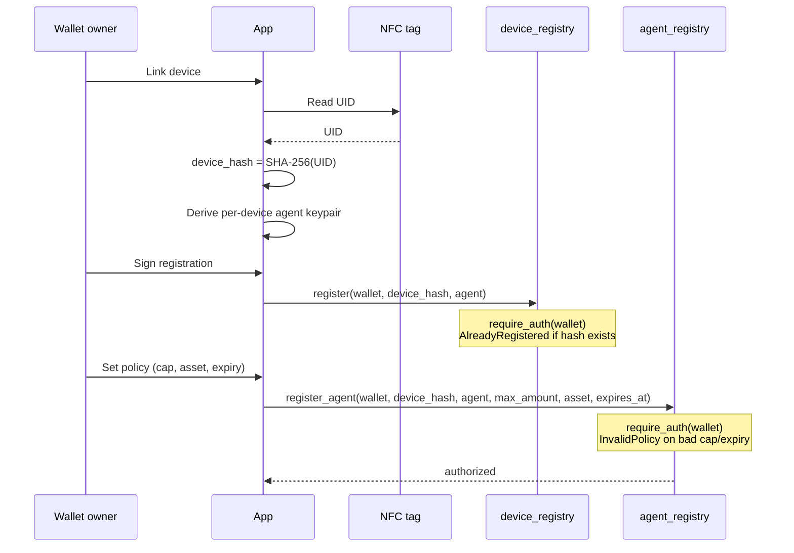
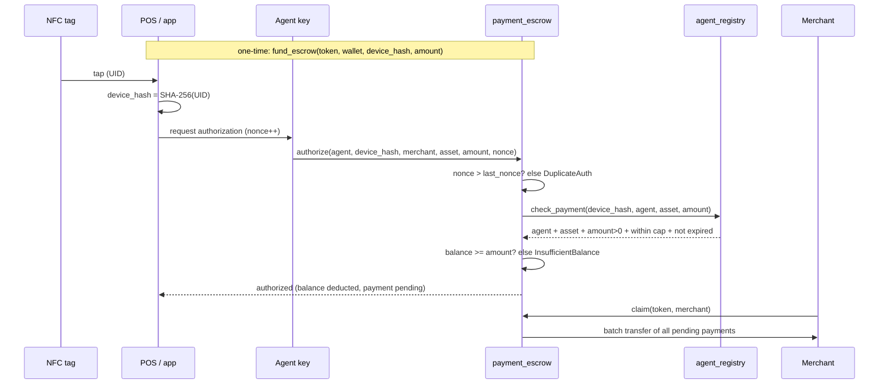
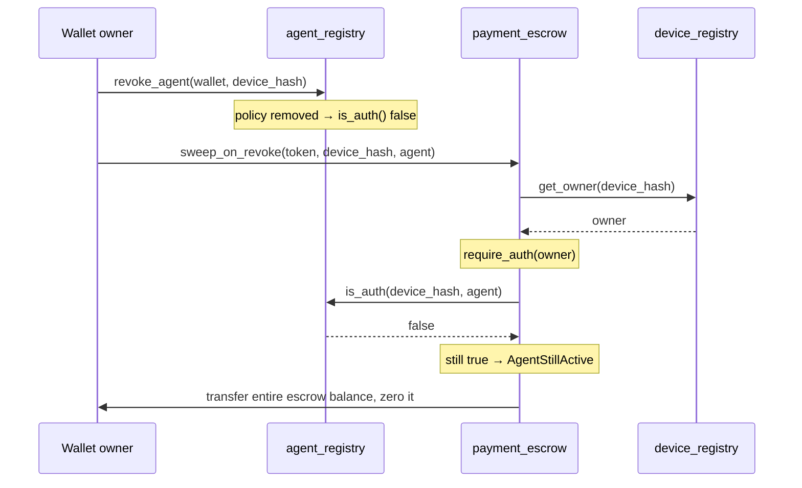

# Noir Wallet — Architecture

Reference architecture for NFC-enabled **constrained delegated payments** on Stellar, implemented with three Soroban contracts and a React Native (Android) app.

Diagrams below are [Mermaid](https://mermaid.js.org/) and render directly on GitHub — no tooling needed to review them.

Contract interfaces are documented in [`Noir/_AI Build Guide - Contracts.md`](../Noir/_AI%20Build%20Guide%20-%20Contracts.md). A full developer walkthrough (SDKs, contracts, deployment, wallet integration, testing) is in [`stellar-development-guide.md`](stellar-development-guide.md). Deployed IDs and WASM hashes are in [`deploy-evidence/`](../deploy-evidence/), with on-chain explorer screenshots in [`docs/Evidence/`](Evidence/README.md).

---

## 1. System overview

The NFC tag is only an **identifier**. It stores no keys, no seed phrase, and no signing material. Its UID is hashed off-chain with SHA-256 and only the resulting 32 bytes (`BytesN<32>`) ever reach chain state.



`payment_escrow` composes the other two at compile time via `contractimport!`, so **build order matters**: `device_registry` + `agent_registry` first, then `payment_escrow`.

---

## 2. Responsibilities

| Component | On/off chain | Responsibility |
|-----------|--------------|----------------|
| `device_registry` | on-chain | Records `device_hash → DeviceInfo { owner, agent, status, created_at }` plus a dense per-wallet device index. Owner-authorized register/revoke. |
| `agent_registry` | on-chain | Stores the constrained `AgentPolicy { agent, max_amount, asset, expires_at }` and exposes `check_payment()` — the single predicate the escrow trusts. |
| `payment_escrow` | on-chain | Holds a pre-funded balance per device, authorizes in-policy payments with nonce replay protection, batch-settles to merchants, and returns funds to the owner on defund/sweep. |
| React Native app | off-chain | Wallet create/import, NTAG213 provisioning, SHA-256 hashing, transaction building/signing, x402 orchestration. |

Every state-changing call carries an on-chain `require_auth()` on the consenting party. Authorization is **never** enforced by the app alone.

---

## 3. Device provisioning



---

## 4. x402 tap-to-pay

Escrow is pre-funded once per device. A tap then authorizes an instant in-policy deduction — no per-tap Horizon submission by the payer.



---

## 5. Revocation and fund recovery

Revoking an agent must not strand escrowed funds. `sweep_on_revoke` returns the device's entire remaining balance to the owner, and refuses while the agent is still authorized.



---

## 6. Authorization model

Two independent records exist per device:

- `device_registry` stores an `agent` field alongside the owner — the ownership record.
- `agent_registry` stores the spending **policy** — the payment authority.

`payment_escrow.authorize` gates on **`agent_registry.check_payment`**, not on `device_registry`. Register the same agent in both unless you deliberately redesign.

A payment is accepted only when all of the following hold:

| Condition | Enforced by | Failure |
|-----------|-------------|---------|
| Strictly increasing nonce | `payment_escrow` | `DuplicateAuth=6` |
| Agent matches the policy | `agent_registry.check_payment` | `AgentNotAuthorized=3` |
| Asset matches the policy | `agent_registry.check_payment` | `AgentNotAuthorized=3` |
| `amount > 0` and `<= max_amount` | `agent_registry.check_payment` | `AgentNotAuthorized=3` |
| Not past `expires_at` | `agent_registry.check_payment` | `AgentNotAuthorized=3` |
| Sufficient escrow balance | `payment_escrow` | `InsufficientBalance=2` |

`max_amount = 0` means uncapped; `expires_at = 0` means never expires.

---

## 7. Trust boundaries

| Boundary | Assumption |
|----------|------------|
| NFC tag | Untrusted. Clonable by design, so it holds no secret. A cloned UID is useless without a funded escrow and an in-policy agent, and the owner can revoke. |
| Agent key | Semi-trusted, constrained. It can spend only the approved asset, up to the cap, before expiry, and only from that device's escrow. |
| Owner wallet | Fully trusted. Sole authority for register, policy, funding, defund, and revocation. |
| Contracts | Trusted after review. Validated by 41 automated tests covering the positive and negative paths; unaudited by a third party (out of sprint scope). |

---

## 8. Build and deploy order

```bash
cd backend

# dependencies first — payment_escrow imports these WASM files at compile time
cargo build --release --target wasm32v1-none -p agent-registry -p device-registry
cargo build --release --target wasm32v1-none -p payment-escrow

# tests (host target)
HOST=$(rustc -vV | awk '/host/{print $2}')
cargo test -p device-registry -p agent-registry -p payment-escrow --target "$HOST"
```

Deploy and initialize in order: `device_registry` → `agent_registry` → `payment_escrow` (escrow init takes both registry IDs). The scripted path is [`scripts/redeploy-contracts.sh`](../scripts/redeploy-contracts.sh), which builds, hashes, deploys, initializes, and writes a timestamped evidence file.
